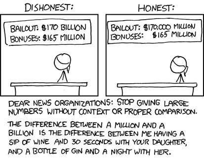

Very recently, an 7.9 magnitude earthquake shook South Central Alaska near Kodiak, triggering tsunami warnings and watches from Attu to Hawaii. It was felt over 400 miles away in Fairbanks. Luckily, there was no tsunami. The earthquake made big news, as there are only a handful of earthquakes of this size per year; there might be one or two other magnitude 8 or greater earthquakes the Earth will see all year. The energy expelled by these quakes are on the order of hundreds of petajoules, or 100,000,000,000,000,000 joules. If some device was invented to convert this energy to electricity and store it at 100% efficiency, it could power an average U.S household for about 2.5 million years. Another analogy for this amount of energy is that of Mt. St. Helens' 1980 eruption. Surely these numbers are huge, but what do they actually mean, and why is understanding them so important?

I will answer these questions in a moment, but I would like to give some background on why I'm writing this post first. I have a certain frustration with the standard American education (and possibly the worldwide standard of education) regarding the difference of treating numbers as numbers and numbers as quantities. xkcd author Randall Monroe has summed up my feelings about the matter quite nicely.

{: text-align: center;}

Crude thoughts aside, the message of the comic is not only mathematically true, but it also makes social sense to give proper sense of numbers, as there is probably a non-trivial percentage of the population who don't understand the difference between a million and a billion.

Back to the questions. The first question is what do these huge numbers actually mean? First of all, it is already hard for the human mind to quantify large numbers over a couple hundred, possibly a few thousand. For this reason, some cultures' numeral system didn't go far past the hundreds or thousands, since it just wasn't necessary. Perhaps the best way to explain is to start small, and small being the number 10. Ten is the number of digits on two regular human hands or feet, two less than a dozen, and is one more than the third perfect square. It is also one order of magnitude. But what exactly is an order of magnitude, and why isn't 20 two orders of magnitude? 

To put it simply, order of magnitudes are whole number powers of ten. Such as 101 is ten, or one order of magnitude. 10 2 is two orders, 103 is three orders, and so on and so forth. In other words, orders of magnitude are a convenient way to get a sense of the size of numbers and differences of size. However, isn't the size of a number just the number itself? Yes and no. When dealing with pure numbers, the intuitive answer is more or less yes, but since the majority of the population aren't mathematicians, most people tend to think of numbers as quantities of something. 

Ten of something isn't usually considered a large group. Ten people for example, isn't a large group. Most vans can transport this many people. Twenty people is twice as large, but a small bus can still fit this many people. There is not that huge of a difference between these two groups and ways of handling these two groups are fairly similar. However, when we get to around 100 people, transporting this many people using buses and vans becomes unweildy. Therefore, a new mode of transportation is needed. Using a commercial airplane becomes more economical up until about 3,000 people, as the largest airliners hold about 300 people, and using around 10 of these flying towns is incredibly expensive. There is no way that I know of to quickly and economically transport 3,000 or more people using just a few vehicles.

Orders of magnitude capture this idea of how "difficult" a number is to achieve or manage. A very easy way to illustrate this idea is counting. Most people can count to ten aloud, as it doesn't take much time. Ask someone to count to a hundred, and you might receive a strange look, but whoever is counting could do it in a reasonable amount of time. Asking anyone to count to one thousand is a large and tedious task, and many people will scoff at doing such an undertaking, and would much rather do something else, like reading this blog. If you've paid attention, we've only gone through 3 orders of magnitude, and already the "difficulty" of handling such a number is beyond that of what most people want to deal with. With every new order of magnitude, the task gets ten times more difficult. This is the whole idea behind treating numbers as quantities. It's very easy to grab a calculator and start adding zeros to a number to make it large, but this robs the concept of the quantity that this number holds.

Back to the first question, what do these numbers actually mean? Well, we know that the larger the number, the harder it is to get to. This gives it more "weight" so to speak, and therefore it is more important. The concept is easily illustrated with earthquake magnitudes (each step is about 32 times more than the last instead of 10, or 1.5 orders of magnitude). Low magnitude earthquakes are incredibly common, ordering on tens of thousands earthquakes per year. It is even possible to create negative magnitude earthquakes by, for example, pushing a penny off of a dog. For the most part, these types of quakes are inconsequantial, since a small number multiplied by 32 is still a small number, such as 0.1 multiplied by 32 is only 3.2. Once we get to large numbers, however, things grow incredibly quickly. If the magnitude 7.9 earthquake used as an example earlier were somehow upgraded to 8.9, that would mean we would need about 30 more Mt. St. Helens eruptions to get the same amount of energy. After all, the largest earthquake recorded was 9.6, which some believe is around the upper limit for terrestially caused earthquakes. I'll leave the math up to you. The dinosaur ending impact is estimated at magnitude 13 (yes, the scale does go above ten) and a magnitude 15 earthquake will rip the Earth apart. The largest quake observed in the universe was a 32 magnitude starquake.

Why do we need to understand numbers like this? Knowledge is power, so to speak. Almost no one talks about interstellar starquake happening, but nearly every one talks about money in terms of cents, tens of dollars, thousands of dollars, and even more in almost every day life. Commercial profits and government budgets are often hot topics, which goes back to the comic up above. Even in terms of efficiency, a 30% increase in efficiency is a huge step, as it is about half an order of magnitude. 

Knowing how to understand numbers is just one step to making an informed decision. Whether people notice it or not, numbers (most of the time as quantities) control many aspects of our lives.